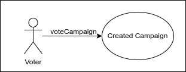
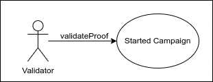
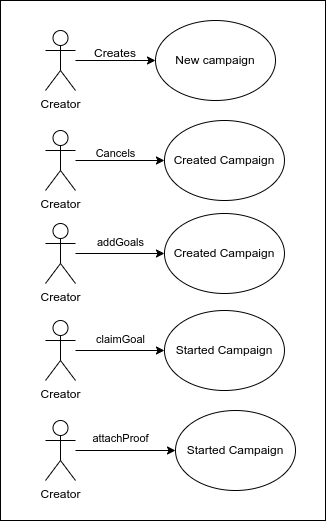
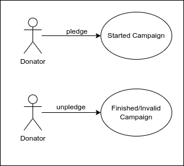
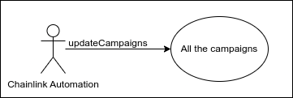
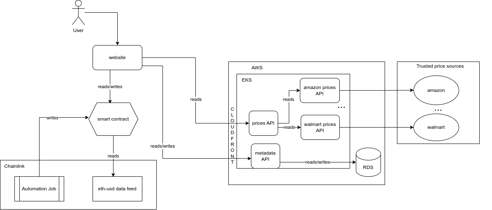

# Fund your social project

This is a smart contract written for the Chainlink Hackathon 2023. It implements a crowdfunding platform that allows users to create and participate in fundraising campaigns. The smart contract leverages the Chainlink ecosystem by using the Chainlink Price Feed contract for price conversions.

## Project Description

The CrowdFund smart contract enables users to create fundraising campaigns for social projects with specified goals and durations. Participants can pledge funds to these campaigns, either in Ether or a specified ERC20 stable token. The progress of each campaign is tracked, and when a campaign meets its goals, the creator can claim the funds one by one and provide proof of achieving the campaign's objective. Validators can review the proof and validate or invalidate the goal accordingly.

## Features

### Campaign Creation

Users can create fundraising campaigns by specifying the number of goals, start and end dates.

### Campaign Cancellation

The creator of a campaign can cancel it if it hasn't started yet.

### Goal Creation

Once a campaign is created, the creator can add multiple goals with corresponding funding targets.

### Pledging

Donators can pledge funds to ongoing campaigns by contributing Ether or ERC20 tokens.

### Unpledging

Donators can retract their pledge if the campaign is in an invalid or finished state.

### Campaign Status Updates

The contract automatically updates the status of campaigns based on the start and end dates, goal validations, and funding achievements by using ChainLink Automation.

### Goal Claiming

Campaign creators can claim funds when they meet the goals by providing proof of achievement.

### Proof Attachment

Campaign creators can attach proof of goal achievement for validation by validators.

### Proof Validation

Validators can review the attached proof and validate or invalidate the goal accordingly.

### Voting

Users with the voter role can vote for campaigns they believe should be funded.

## Roles/Actors

The smart contract includes the following actors/roles:

### Owner

The contract deployer who has the ability to pause and unpause the contract and grant/revoke voter and validator roles. This role can execute every method.

### Voter

Users with this role can vote for campaigns they believe should be funded.



### Validator

Users with this role can review and validate or invalidate the attached proof for campaign goals.



### Campaign Creator

The user who creates a campaign. They have additional permissions related to campaign management.



### Donator

The user who donates to a campaign.



### Chainlink Automation



## Smart Contract Dependencies

The CrowdFund smart contract relies on the following external contracts and libraries:

### OpenZeppelin Contracts

#### Ownable

Provides basic access control and ownership functionality.

#### Pausable

Allows pausing and unpausing the contract.

#### AccessControl

Enables managing role-based access control.

#### Chainlink Contracts

AggregatorV3Interface: Provides the interface for accessing price feed data.

#### ERC20

An interface for interacting with ERC20 tokens.

## Design

### Architecture

The user interacts with the contract by using a front-end. Optionally, they can use the verified contract directly. The campaign's goals are obtained from an aggregator that is a service that gets some products from validated markets.



## Smart Contract

### Description

The CrowdFund smart contract allows users to create crowdfunding campaigns, pledge funds or tokens to campaigns, vote for campaigns, add campaign goals, and claim goals based on the campaign's success. The contract includes role-based access control and pause functionality to ensure secure and controlled operations. All the metadata related to the campaign is saved in a different service called "metadata API".

Finally, the solution uses ChainLink data price feeds to convert the Ether price to usd when the creator wants to claim a goal and also the Chainlink Automation to execute the contract off-chain and update the campaign status.

### Methods

#### Campaigns

- `create(uint256 _goals, uint256 _startAt, uint256 _endAt)`: Creates a new crowdfunding campaign with the specified goals, start time, and end time.
- `cancel(uint256 _id)`: Cancels a campaign that has been created but not yet started.
- `addGoals(uint256 _id, NewGoal[] calldata _goals)`: Adds campaign goals to a created campaign.
- `getCampaigns()`: Retrieves an array of all campaigns.
- `getGoals(uint256 _id)`: Retrieves an array of goals for a specific campaign.
- `claimGoal(uint256 _id, uint256 _goalId)`: Allows the campaign owner to claim a specific goal if the required funds or tokens have been raised.
- `attachProof(uint256 _id, uint256 _goal_id, string calldata _goal_proof)`: Allows the campaign owner to attach proof of achieving a goal.

#### Donations

- `pledge(uint256 _id, uint256 _amount)`: Allows users to pledge funds or tokens to a started campaign.
- `unpledge(uint256 _id)`: Allows users to unpledge their funds or tokens from a campaign that is either finished or invalid.

#### Validations

- `validateProof(uint256 _id, uint256 _goal_id, GoalStatus _status)`: Allows a validator to
  validate or invalidate the proof attached to a goal.

#### Votes

- `voteCampaign(uint256 _id)`: Allows voters to vote for a campaign.

#### Pause Functionality

- `pause()`: Pauses stakings and withdrawals in the contract.
- `unpause()`: Unpauses stakings and withdrawals in the contract.

#### Permissions Methods

- `grantVoterRole(address _address)`: Grants the voter role to the specified address.
- `revokeVoterRole(address _address)`: Revokes the voter role from the specified address.
- `grantValidatorRole(address _address)`: Grants the validator role to the specified address.
- `revokeValidatorRole(address _address)`: Revokes the validator role from the specified address.

### Roles

- `VOTER_ROLE`: Role assigned to addresses that are allowed to vote for campaigns.
- `VALIDATOR_ROLE`: Role assigned to addresses that are allowed to validate proofs.

### Dependencies

The CrowdFund smart contract has the following dependencies:

- OpenZeppelin Contracts: Provides base contracts for Ownable, Pausable, and AccessControl functionalities.
- Chainlink Contracts: Provides the AggregatorV3Interface for price feed data.

## Production

The solution isn't placed in Ethereum mainnet.

## Testnet

Currenly we're using Goerli testnet:

- MockERC20 deployed to 0x7c1516C7Fe8EF4d67297BcC4433c7eBAf16779C3
- Crowdfund deployed to 0x8449DDDc934663210FBdD4e4E32FdbBC8E7385f5
- Chainlink automation https://automation.chain.link/goerli/40014270112186586710872972971551308496725179069292283278035680608805269185661

### Verification

`npx hardhat verify --network goerli --contract contracts/Crowdfund.sol:CrowdFund 0x8449DDDc934663210FBdD4e4E32FdbBC8E7385f5 0x7c1516C7Fe8EF4d67297BcC4433c7eBAf16779C3 6048000 1 0xD4a33860578De61DBAbDc8BFdb98FD742fA7028e`

## Local usage

### Requirements

- Docker
- Docker compose

### Start the components

To run the project locally you should use Docker compose. Once installed, build and run the containers using the command:

```
docker-compose up
```

or

```
docker-compose up --build
```

if you want to rebuild the projects.

To watch the containers use the command

```
docker ps
```

### Components

#### Aggregator

This service collects the items and prices for verified markets. It should be available at `localhost:5000/products`. You can also get a specific product price using `localhost:5000/products/id`

#### Smart Contract

It will run in the local blockchain in the container called `blockchain`. It should be available at `0.0.0.0:8545` (the chain id is 31337). Check the contract address in the output of the `bootstrap` container:

`bootstrap   | Crowdfund deployed to 0xe7f1725E7734CE288F8367e1Bb143E90bb3F0512 `

#### Metadata

This service will save the metadata for the campaign (name, description, etc). To create a new entry send a POST to `localhost:4000/campaigns`, a GET to `localhost:4000/campaigns` to get all the campaigns or `localhost:4000/campaigns/<id>` to get just one campaign. The body in the post can be any body because it's a mock API.

## Contributing

Thank you for considering contributing to the CrowdFund project! Contributions are highly encouraged and welcome. Here are a few ways you can contribute:

- Report issues: Help identify and report any bugs or issues you encounter while using the platform by opening an issue in the repository.

- Suggest improvements: If you have ideas for improving the project, feel free to open an issue and share your suggestions.

- Submit pull requests: If you'd like to contribute code changes or enhancements to the project, you can submit a pull request. Make sure to follow the project's guidelines and coding conventions.

Before contributing, please review the [contribution guidelines](CONTRIBUTING.md) for this project.

## License

This project is licensed under the [MIT License](LICENSE).
